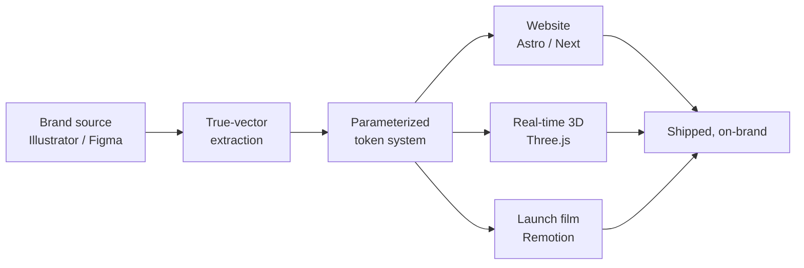

---
## The short version

**I build brands and digital experiences from the first idea through the final launch.**

My work sits at the intersection of identity, strategy, design, motion, and front-end development. Keeping those pieces connected means the finished product stays true to the original concept instead of losing clarity during handoff.

> **Most of my recent work lives in private client and agency repositories.**
> You can see the finished projects and case studies at 👑 [maklerichards.com](https://www.maklerichards.com).

 

## What I actually do

### Brand identity

Visual identities, logos, typography, color systems, and brand guidelines designed to work consistently across websites, campaigns, motion, and print.

<kbd>Illustrator</kbd> <kbd>Photoshop</kbd> <kbd>SVG</kbd> <kbd>Design systems</kbd>

### Digital design

Websites and interfaces built around clear hierarchy, thoughtful interaction, and strong visual systems, then developed to closely match the original design.

<kbd>Figma</kbd> <kbd>Astro</kbd> <kbd>React</kbd> <kbd>Tailwind</kbd>

### Motion & 3D

Cinematic animation, interactive 3D, and launch visuals created for digital campaigns, brand experiences, and the modern web.

<kbd>Three.js</kbd> <kbd>Remotion</kbd> <kbd>WebGL</kbd> <kbd>GSAP</kbd>

### Creative strategy

Positioning, campaign direction, and scalable creative systems that connect the message, visual language, and final execution.

<kbd>Art direction</kbd> <kbd>Positioning</kbd> <kbd>Campaigns</kbd> <kbd>Systems</kbd>

 

## Toolkit

 

 

 

## One source, every output

Change one palette value and the site, the 3D scene, and every video variant regenerate together. No manual re-export, no drift between channels — which is the actual reason brands look inconsistent everywhere else.

 

## The receipts

 

