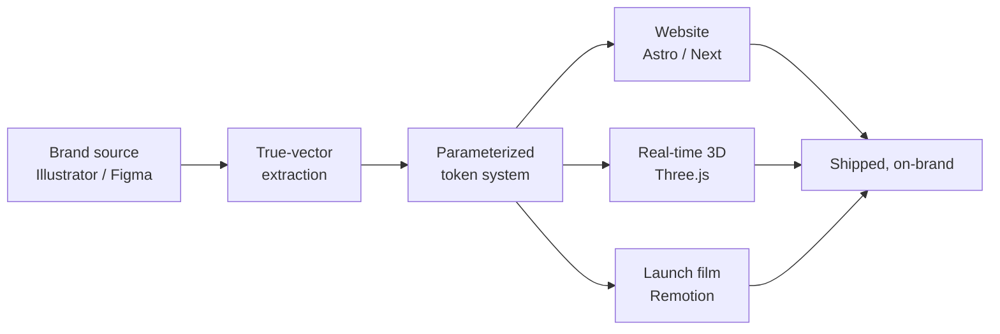

 

 

---

## The short version

I do **brand identity, digital design, and creative strategy** — and then I build the thing myself.

That last part is the whole point. Most brand work dies in the handoff: a beautiful deck, a PDF of specs, and a developer left guessing what the motion was supposed to feel like. I close that gap. The identity, the site it lives on, the 3D render, and the launch film all come out of **one parameterized system** — so they can't drift apart.

> [!NOTE]
> **My public repo count is zero — that's client work, not inactivity.** Everything I ship is under private agency repos. The contribution graph below is the honest record: **1,000+ contributions in the last year.** Want to see the actual output? [maklerichards.com](https://www.maklerichards.com).

 

## What I actually do

<table>
<tr>
<td width="50%" valign="top">

### Brand identity
Marks rebuilt as **true vector** — real curves and gradient stops pulled straight from the Illustrator source, so the logo stays razor-sharp at any size instead of quietly rasterizing on export.

<kbd>Illustrator</kbd> <kbd>SVG</kbd> <kbd>Design systems</kbd>

</td>
<td width="50%" valign="top">

### Digital design
Sites and interfaces designed and **shipped by the same person**. No handoff, no spec drift, no "that's not what the mockup did."

<kbd>Figma</kbd> <kbd>Astro</kbd> <kbd>Next.js</kbd> <kbd>Tailwind</kbd>

</td>
</tr>
<tr>
<td width="50%" valign="top">

### Motion &amp; 3D
Launch films and cinematic product renders built as **code, not timelines** — so a palette change regenerates every variant instead of forcing a manual re-render.

<kbd>Three.js</kbd> <kbd>Remotion</kbd> <kbd>WebGL</kbd> <kbd>GSAP</kbd>

</td>
<td width="50%" valign="top">

### Creative strategy
Positioning and art direction that survive contact with production — because the person writing the strategy is the one who has to build it.

<kbd>Art direction</kbd> <kbd>Positioning</kbd> <kbd>Systems</kbd>

</td>
</tr>
</table>

 

## Toolkit

 

 

 

## One source, every output

Change one palette value and the site, the 3D scene, and every video variant regenerate together. No manual re-export, no drift between channels — which is the actual reason brands look inconsistent everywhere else.

 

## The receipts

 

