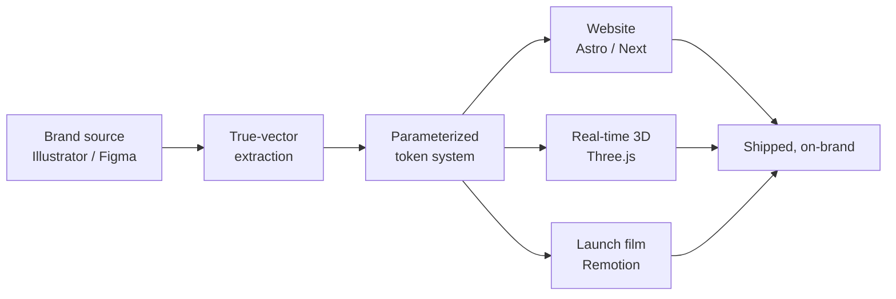

---
## The direction

**I'm interested in the space where design, technology, motion, and AI start to overlap.** Most of my work lives somewhere between those areas, whether I'm developing an identity, designing an interface, or experimenting with a new tool.

The tools will keep changing, and that is part of what keeps the work interesting. I try to stay curious, use them with purpose, and make things that feel thoughtful, useful, and well made.

> **Much of this work lives inside private client projects, agency repositories, and active experiments.**
> The clearest view of what I am creating is at [maklerichards.com](https://www.maklerichards.com).

 

## Building toward what comes next

<table>
<tr>
<td width="50%" valign="top">

### Identity &amp; systems
Exploring identity as a flexible system rather than a fixed collection of assets, designed to adapt across interfaces, motion, campaigns, and physical applications.

<kbd>Illustrator</kbd> <kbd>SVG</kbd> <kbd>Design systems</kbd>

</td>
<td width="50%" valign="top">

### Digital experiences
Designing websites and interfaces where visual direction, interaction, and implementation feel like parts of the same system rather than separate stages of production.

<kbd>Figma</kbd> <kbd>Astro</kbd> <kbd>React</kbd> <kbd>Tailwind</kbd>

</td>
</tr>
<tr>
<td width="50%" valign="top">

### Motion &amp; spatial design
Using animation, 3D, and real-time graphics to create experiences that move, respond, and extend beyond static layouts.

<kbd>Three.js</kbd> <kbd>Remotion</kbd> <kbd>WebGL</kbd> <kbd>GSAP</kbd>

</td>
<td width="50%" valign="top">

### Creative technology
Combining code, automation, and emerging AI tools to expand the creative process, from early exploration through final production.

<kbd>AI workflows</kbd> <kbd>Creative coding</kbd> <kbd>Automation</kbd> <kbd>Prototyping</kbd>

</td>
</tr>
</table>

 

## Toolkit

 

 

 

 

 

## One source, every output

Change one palette value and the site, the 3D scene, and every video variant regenerate together. No manual re-export, no drift between channels — which is the actual reason brands look inconsistent everywhere else.

 

## Design At Will

 

